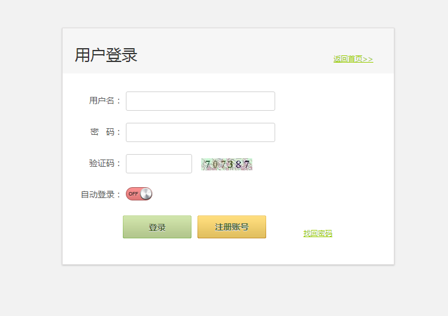
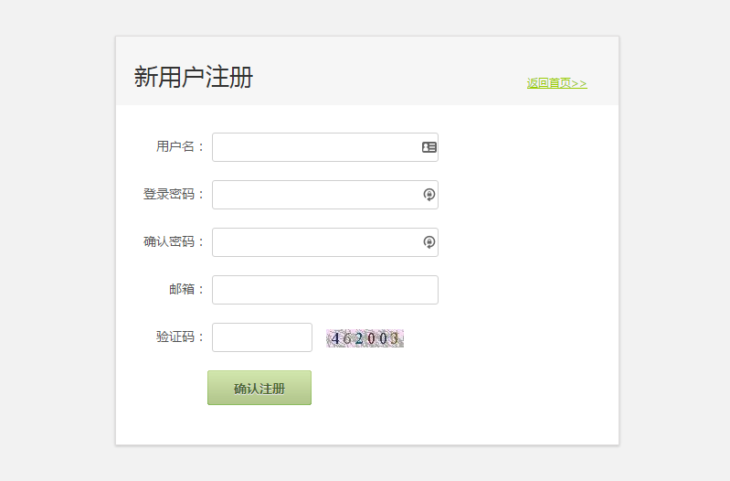

## 介绍
使用 SSH 框架写的一个小项目，主要功能就是用来展示古文书籍，这里只是完成一部分功能。虽然功能不是太多，但是涉及到了很多的技术，比较适合入门学习。

## 程序功能
+ 用户注册
    - 邮箱验证： Java Mail，随机用户激活码， Spring 线程池（ 邮件发送使用线程池中一个单独线程）
    - 用户名、邮箱唯一性（ ajax 检查）
    - Js + Struts2 双重检验（非空，长度，合法性）
    - 验证码
    - 用户名限制输入（不能输入中文或特殊字符）
    - 密码： MD5 加密
+ 用户登录
    - 自动登录：filter + cookie
    - Js + Struts2 双重检验
    - 验证码
+ 密码找回
    - 用户名合法性检测
    - 通过邮箱发送密码重置链接
+ 用户中心
    - 查看个人信息
    - 更改密码
    - 查看近期操作(通过日志实现)
    - 查看收藏（删除）
+ 管理中心(具有管理员权限)
    - 查看当前用户（ 删除用户，查看该用户近期操作）
    - 查看近期操作（所有用户）
+ 分页显示
    - 封装 Pager 类（包含查询结果，总记录数， 每页记录数， 总页数，当前页数，上一页，下一页，首页，尾页等信息）
+ 限制直接访问 jsp 文件
    - Filter（过滤所有 jsp 文件，重定向到 index.action）
+ 用户权限控制
    - Interceptor + 注解
+ 日志记录
    - Interceptor + 注解（同时有一个使用 Spring AOP 进行拦截的示例）
    - 自动删除 30 天之前的日志： Spring 定时器（程序中也有一个使用 Quartz 的示例）
+ 书籍查看
    - 分类检索
    - 搜索

## 截图
**登录注册**





## 具体实现
### 邮箱验证
用户注册成功后，系统会自动发送激活邮件到用户邮箱，用户点击激活链接，激活之后才能正常登录，否则会给出用户尚未激活的提示。发送邮件的功能是使用 java mail 进行实现的，原邮件地址为 sdu_doc@163.com，密码为 sdudoc。激活链接包括用户名以及随机产生的验证码，验证码产生规则为： username + 随机 double，然后再进行 MD5 加密。此验证码会保存到数据库表中，当用户点击链接后，会根据链接中的用户名和验证码检索数据库，如果发现数据库中存在对应记录，该用户的状态更改为已激活，用户激活成功。另外，这里用到了 Spring的线程池，因为发送邮件需要验证等一系列步骤，如果和 action 的逻辑代码在一个线程中可能造成 action 长时间不能返回，从而降低用户体验度。因此，这里将邮件的发送放到了一个单独的线程中，从而使 action 可以立即返回。如果没有成功发送邮件，用户可以选择重新发送邮件。 Spring 线程池配置以及具体用法可以查看 applicationContext.xml 以及 SendMailHelper.java。

### 用户名、邮箱唯一性验证
项目中设定用户名和其对应邮箱必须唯一，因此在注册时需要告诉用户用户名和邮箱是否可用（是否已经注册），这里主要使用 ajax进行异步验证，使用 jquery简化 ajax 调用， jquery 对 ajax 调用进行了封装，兼容多浏览器。同时对注册时用户名和邮箱输入框加入焦点事件，当失去焦点时就进行 ajax 检测，然后给出检查结果，如果不可使用，则将提交按钮设置为不可用，使用户无法提交表单。

### Js+Struts2 双重检测
在登录、注册等需要填写表单的网页中，我们需要检测输入的数据进行合法性检测，例如数据是否为空，用户名长度是否验证要求，两次密码输入是否一致，邮箱格式是否正确等等。一般我们会在客户端使用 js 进行检测，但是我们不排除个别用户将 js 删除，故意提交错误数据的可能性，因此在服务器端必须要进行相应检测。在服务器端我们使用 Struts2 进行检测。我们这里使用的是 xml 的检测方式， 如果数据不和要求就会返回到输入页面，并且给出错误提示。

### 验证码
验证码的实现主要依赖于 session。首先在服务器端生成验证码要显示的字符串（一般是随机数），然后将生成的字符串保存到 session 中，然后再根据验证码生成对应图片，传送到客户端。用户提交表单后，会首先比对传入的验证码和session 的是否一致，如果不一致，则返回输入页面。这里需要注意的是我们在使用 Struts2 显示验证码时，要配置 action 的属性，因为与一般的 action 不同，验证码的 action 需要返回图片。因此需要配置 action 的 type 为 stream。并提供一个 InputStream 类型的成员变量。

### 自动登陆
自动登陆需要将用户的信息保存在客户端，现在一般使用 cookie 完成这个工作。在登陆时如果选择自动登陆，则将用户名和密码写到客户端，当用户再次访问网站时就可以从 cookie 中获得信息，然后自动登录。自动登陆的实现逻辑是在一个 filter 中实现的，该 filter 过滤所有 url 地址，当访问网站任何一个地址时，会首先判断用户是否登录，如果用户尚未登录， 会查看 cookie 中是否有相应信息，如果 cookie 中存在用户信息则自动登陆，如果没有，程序继续往下执行。

### 密码找回
密码找回和用户激活原理差不多，都是发送邮件到用户邮箱，用户点击指定链接进行下一步操作。不过这里为了方便，没有将产生的验证码保存到数据库中，而是保存到了 session 中，因此如果 session 过期，那么链接就会失效。另外，在发送邮件之前会首先验证用户输入的用户名的合法性。如果合法才发送邮件，如果不合法就不发送。

### Interceptor + 注解进行细粒度权限控制以及日志记录
项目中对于用户权限控制和日志记录都是使用的 Interceptor+注解的方式。Struts2 中的 Interceptor 就相当于 Spring 中 AOP，都是面向切面的编程思想。具体实现方式为首先定义注解即： `@interface` 用来标志要进行的操作，本程序定义了两个注解， Permission 对应于权限控制， MethodDesc 对应于日志记录，如果我们的 action 需要进行权限控制或者日志记录，只需要在 action 对应的方法上面加上相应的注解，并设置对应的值，例如在 Permission 中设置什么用户可以访问该 action。在拦截器中会拦截 action，通过反射获得方法上的注解信息，如果不包含对应的注解（这里主要是 Permission 和 MethodDesc），则继续往下执行，如果包含，就进行相应的操作，对于 Permission 来说就是检查当前用户是否有权限访问该 action，对于 MethodDesc 来说就是将用户的当前操作写入到日志中。这种方式允许我们进行细粒度的控制，可以精确到某一个具体的 action，并且具有很好的扩展性，以后如果添加什么方法，只需在该方法上添加对应的注解，就可以对当前方法进行相应的控制。 如下所示：
```java
@MethodDesc(description = "删除用户
@Permission(Constants.USER_ADMIN)
@Action("delUserById")
public String deleteUserById(){}
```

项目在一开始是使用的 Spring AOP+注解进行的日志管理，其中是对 Action进行的拦截。但是如果对 Action 层使用 Spring AOP 进行拦截，那么在使用 Interceptor 时会有一些问题（具体就是使用 Interceptor 拦截 Action 操作时，无法获得对应方法上的注解。 将拦截到的对象打印出来之后，发现是一个代理 Action 对象，而不是原 Action 对象，猜想应该是 Spring AOP 的缘故，但是没有深入研究具体细节）， 因此改为使用 Interceptor，但是项目中确实有一 个 使 用 Spring AOP 的 示 例 ， 具 体 配 置 和 使 用 可 以 查 看 `applicationContext.xml` 和 `LogAspect`。

### Spring 定时任务
项目中定时任务主要用来实现删除日志的操作，在每天的 0 点执行一遍定时任务，删除 30 天之前的日志记录。这里采用的是 Spring 中自带的定时任务，因为配置比较方便，只需要在 `applicationContext.xml` 中添加 Spring 定时器配置：
```xml
<!-- 配置Spring定时任务-->
<task:executor id="executor" pool-size="5"/>
<task:scheduler id="schedular" pool-size="10"/>
<task:annotation-driven executor="executor"
scheduler="schedular"/>
```

然后在类上添加@Component 注解，在方法上添加 `@Scheduled(cron = "00 0 * * ? ")` 就可以使用定时执行该方法了，可以查看 `TaskManager.java`。
另外项目中也有一个集成 quartz 来执行定时任务的示例，不过配置相对繁琐一些，具体配置和使用可以查看 `applicationContext.xml` 和 `QuartzTask.java`。

## 分页

分页显示显示是一个网站必须要有的功能，因为随着记录的增多不可能一次将记录全部显示出来，在 Hibernate 中，我们使用 `Criteria` 可以方便的实现分页，只需要调用 `setFirstResult()` 设置第一条记录，调用 `setMaxResults()` 设置要选取的记录数，就可以实现查询对应的记录。一般分页显示的时候都会显示共有多少条记录、共有多少页、上一页、下一页、尾页等信息，这里设计了一个 Pager 类，其中封装了当前要显示的记录、当前页数、总记录数、总页数、首页、尾页、上一页、下一页等信息，这样，我们在 jsp 中就可以很方便的使用这些信息，例如：共`<s:property value="logPager.recordTotal"/>` 条记录

